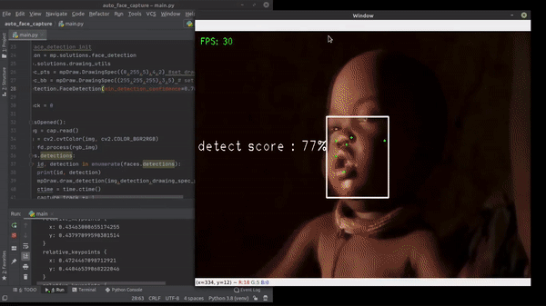

# Auto face Capture :stuck_out_tongue_winking_eye:

## ✔️ **Description 📑**
___
This is a simple projest which detects faces of people from images and video/web cam feeds by drawing bounded boxes round the axis of the detected faces. It also detects physical feature points within the bounded box which include: The eyes :eyes: , nose 👃 and ears 👂.

## ✔️ **Libraries and tools** **🛠️**
___

 
     
     
    
    <a href="http://www.opencv.org/" target="_blank"> 
    <a href="http://www.opencv.org/" target="_blank"> 
    
    

## ✔️ **Tech stack**
___
    * Python 
    * openCv
    * Mediapipe
    * Cvzone
    * Numpy
  
